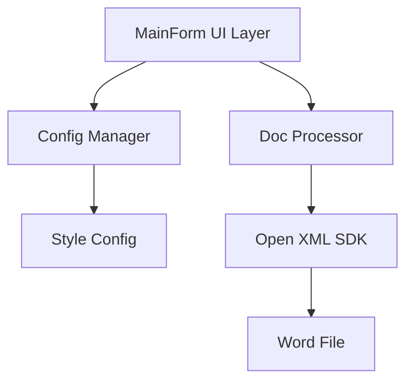

## Product Overview

一个基于 .NET 8 和 Windows Forms 开发的桌面应用程序，旨在帮助用户快速统一 Word 文档的排版格式。该工具通过 Open XML SDK 直接操作 Word 文档结构，无需安装 Microsoft Word 即可批量处理文档，实现对一至四级标题及正文的样式标准化。

## Core Features

- **文档导入与解析**：支持选择并导入 .docx 格式的 Word 文档，解析文档内部结构和样式。
- **标题样式配置**：提供设置面板，允许用户自定义一至四级标题的字体名称、字号大小、段前间距、段后间距。
- **正文样式配置**：允许用户设置正文内容的字体名称和字号大小。
- **批量处理应用**：将配置好的样式规则应用到当前导入的文档中，自动更新所有匹配的段落样式。
- **文档导出与保存**：支持将处理后的文档保存为新文件或覆盖原文件，并提供处理完成的状态反馈。

## Tech Stack

- **开发平台**: .NET 8
- **UI 框架**: Windows Forms
- **文档处理库**: DocumentFormat.OpenXml (Open XML SDK)
- **编程语言**: C#

## Architecture Design

### System Architecture

系统采用经典的 Windows Forms 事件驱动架构，结合分层设计模式，确保 UI 逻辑与文档处理逻辑分离。



### Module Division

- **UI 模块**: 负责主窗口、设置面板、文件对话框及用户交互。
- **配置模块**: 管理标题和正文的样式配置（字体、字号、间距）。
- **处理模块**: 核心业务逻辑，使用 Open XML SDK 读取文档、识别段落类型、应用样式并保存。

### Data Flow


## Implementation Details

### Core Directory Structure

```
WordTools2/
├── FormMain.cs           # 主窗体
├── FormMain.Designer.cs  # 主窗体设计器代码
├── Program.cs            # 程序入口
├── Services/
│   ├── DocumentService.cs    # 文档读写与处理逻辑
│   └── StyleConfig.cs        # 样式配置数据模型
├── Models/
│   └── ParagraphStyle.cs     # 段落样式定义
└── Packages/
    └── DocumentFormat.OpenXml
```

### Key Code Structures

```
// Models/ParagraphStyle.cs
public class ParagraphStyle
{
    public string FontName { get; set; }
    public double FontSize { get; set; }
    public double SpaceBefore { get; set; }
    public double SpaceAfter { get; set; }
}

// Services/DocumentService.cs
public class DocumentService
{
    public void ApplyStyles(string filePath, Dictionary<string, ParagraphStyle> styles) { }
    private void ProcessParagraph(Paragraph paragraph, ParagraphStyle style) { }
}
```

### Technical Implementation Plan

1. **文档解析与样式识别**: 使用 Open XML SDK 遍历文档中的所有段落，通过 `ParagraphProperties` 识别现有的 Heading 1-4 及 Normal 样式。
2. **样式应用逻辑**: 创建或更新 `Style` 定义部分，并在 `ParagraphProperties` 中设置 `RunFonts` 和 `Spacing`。
3. **UI 交互设计**: 使用 `PropertyGrid` 或自定义控件展示层级样式设置，提供实时预览功能（可选）。

### Integration Points

- **DocumentFormat.OpenXml**: 核心依赖，用于 .docx 文件的底层操作。
- **System.Windows.Forms**: 提供标准桌面控件（OpenFileDialog, SaveFileDialog, Button, TextBox 等）。

## Technical Considerations

### Performance Optimization

- 对于大文件，使用 `OpenXmlReader` 进行流式读取以减少内存消耗。
- 在后台线程执行文档处理操作，防止 UI 冻结（使用 `BackgroundWorker` 或 `Task.Run`）。

### Security Measures

- 验证输入的文件路径，防止路径遍历攻击。
- 在处理前备份文件，防止数据丢失。

### Scalability

- 当前设计为单文件处理，未来可扩展为多文件批量处理模式。
- 配置可序列化为 JSON/XML，便于保存和加载预设方案。

### Development Workflow

- 使用 Visual Studio 2022 进行开发。
- 配置 .NET 8 SDK 环境。
- 通过 NuGet 包管理器安装 `DocumentFormat.OpenXml`。

此项目为 Windows Forms 桌面应用程序，不涉及现代 Web 前端框架。设计将遵循 Windows 原生界面规范，注重实用性和操作效率。

## 设计风格

采用经典的 **Windows Fluent Design** 简约风格，保持界面整洁专业。使用系统默认字体，确保与 Windows 操作系统无缝融合。

## 界面布局

1.  **顶部功能区**：包含"打开文档"、"应用格式"、"保存文档"三个主要操作按钮。
2.  **左侧配置面板**：使用 TreeView 或 Grouped 控件分类展示"一级标题"、"二级标题"、"三级标题"、"四级标题"和"正文"的设置项。
3.  **设置项内容**：每个分类下包含字体选择下拉框、字号数值输入框、间距数值输入框（仅标题）。
4.  **右侧状态区**：显示当前加载的文件名、处理进度条及操作日志。

## 交互细节

- 支持拖拽 .docx 文件到窗口进行加载。
- 点击"应用格式"时显示进度条动画。
- 操作完成后弹出提示框告知成功或失败。